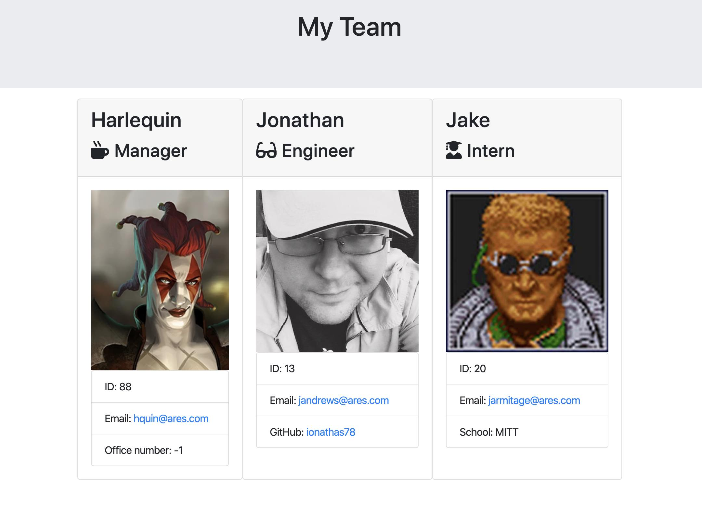
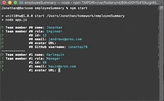

# Team Summary - Unit 10 OOP Homework

> You build the team. We'll build the index.

This homework dealt with using OOP-style modules in JS, specifically with ES6 classes and class inheritance.

## User Story

```
AS A team leader
I WANT an index of my teammates and how to contact them
SO THAT I'll be able to manage them more effectively
```

```
GIVEN THAT I have my team's data
WHEN I launch this app
THEN I want to be presented with a series of prompts that will populate a combined HTML page
WHEN I enter data for a user
THEN I want to be asked questions appropriate to their role
WHEN I finish entering data for one user
THEN I want to be able to transition into the next without any fuss.
```



_*Ares, Harlequin, Jake Armitage, and Shadowrun belong to [Catalyst Game Labs](https://www.catalystgamelabs.com)_

## Table of Contents
* [Technologies](#Technologies)
* [Getting Started](#Getting)
* [Usage](#Usage)
* [Tests](#Running)
* [Project Status](#Project)
* [Questions](#Questions)

## Technologies
Node.js\
Jest\
Inquirer\
Axios w/ GitHub API

## Getting Started
```
npm install
```
This app uses the following modules:
inquirer\
jest


## Usage
```
node app
OR
npm start
```
This app doesn't take any command line parameters.

## Running the Tests
```
npm test
```
The tests for this app check the Classes in the lib folder.

## Project Status
Complete in v1.0


## Questions
For questions, contact me via email or DM.


### ionathas78

This file generated on 4/13/2020 by goodReadMeGenerator, copyright 2020 Jonathan Andrews
